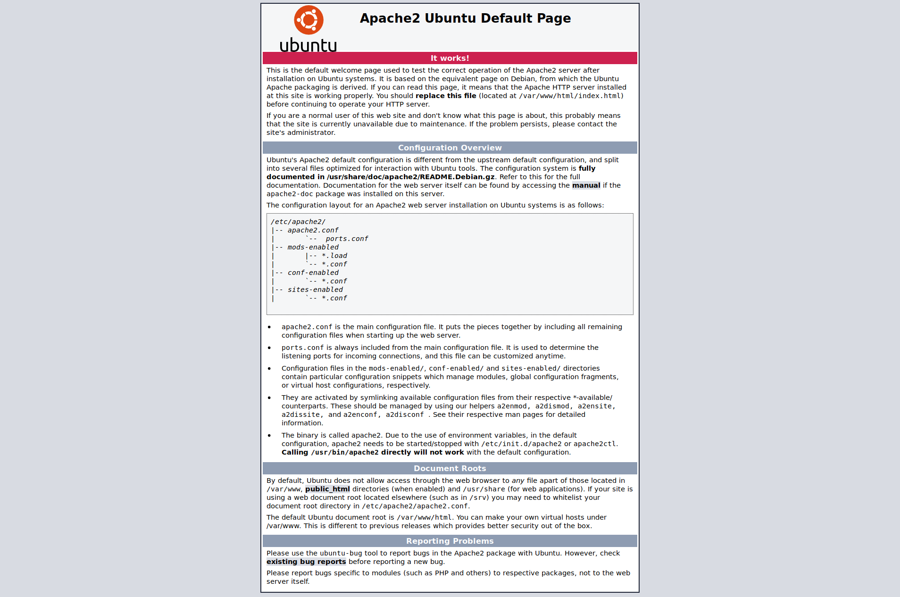
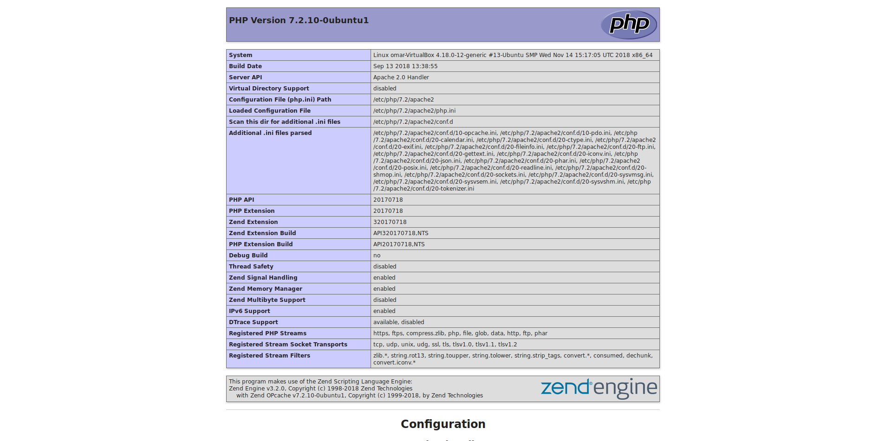

## h6
System specs used in this assigment
<pre><code>Gpu: Nvidia Geforce GTX 560 TI
CPU: Intel i5-3450 @ 3.5ghz
Memory: 2gb</code></pre>
The operating system is ubuntu budgie 18.10
All task were doing in a virtualbox
Im installing lamp stack (apache,mariadb,php-fpm)

### apache
First install apache
<pre><code>sudo apt-get install apache2</code></pre>
i visit <a href="http://localhost">http://localhost</a>

### mariadb
Next step is to install mariadb
<pre><code>sudo apt-get install mariadb-server</code></pre>
configure mariadb to add a user and a password
<pre><code>sudo mariadb -u root
GRANT ALL PRIVILEGES ON *.* TO 'test'@'localhost' IDENTIFIED BY 'password';
</code></pre>
create a database
<pre><code>create schema test;
</code></pre>

### php-fpm
now to install php-fpm to apache
<pre><code>sudo apt-get install php-fpm php</code></pre>

tell apache to use php-fpm instead of libapache-mod-php*
<pre><code>sudo a2enmod proxy_fcgi setenvif
sudo a2enconf php-7.2-fpm</code></pre>
now test php-fpm                                      
/var/www/html/index.php
<pre><code>&ltphp phpinfo(); ?&gt</code></pre>
install php-mysql to test the database
<pre><code>sudo apt-get install php-mysql</code></pre>
/var/www/html/index.php
<pre><code>&ltphp
$servername = "localhost";
$username = "test";
$password = "password";
$dbname = "test";

// Create connection
$conn = new mysqli($servername, $username, $password, $dbname);
// Check connection
if ($conn->connect_error) {
    die("Connection failed: " . $conn->connect_error);
}

$sql = "SELECT * from tablename";
$result = $conn->query($sql);

if ($result->num_rows > 0) {
    // output data of each row
    while($row = $result->fetch_assoc()) {
        echo "id: " . $row["id"]. " - Name: " . $row["name"];
    }
} else {
    echo "0 results";
}
$conn->close();
?&gt</code></pre>

### salt module
Heres the salt module for this configuration
[https://github.com/obb12/h6.git](https://github.com/obb12/h6.git)

#### sources
1. [https://www.a2hosting.com/kb/developer-corner/mysql/managing-mysql-databases-and-users-from-the-command-line](https://www.a2hosting.com/kb/developer-corner/mysql/managing-mysql-databases-and-users-from-the-command-line)
2.   
[http://terokarvinen.com/2018/aikataulu-palvelinten-hallinta-ict4tn022-3004-ti-ja-3002-to-loppukevat-2018-5p](http://terokarvinen.com/2018/aikataulu-palvelinten-hallinta-ict4tn022-3004-ti-ja-3002-to-loppukevat-2018-5p)
